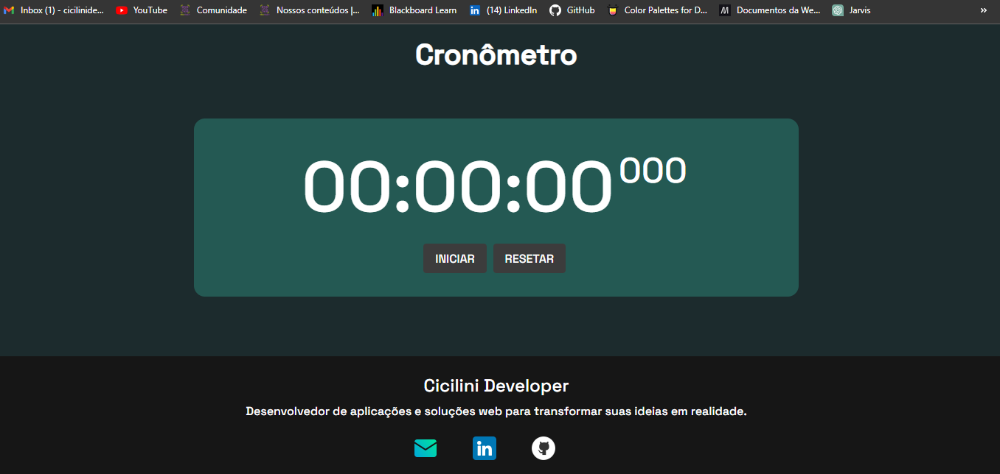

# ⏲️ Cronômetro Simples

Este é um cronômetro simples criado em HTML, CSS e JavaScript que permite que você acompanhe o tempo.

## Funcionalidades

- **Iniciar/Parar:** Você pode iniciar o cronômetro para contar o tempo e pausá-lo quando desejar.
- **Zerar:** O botão de zerar permite redefinir o cronômetro para 00:00.
- **Precisão:** O cronômetro mostra o tempo com precisão de segundos.
- **Interface Amigável:** A interface é simples e fácil de usar, com botões de controle intuitivos.

## Uso

Para usar o cronômetro, basta clicar no botão "Iniciar" para começar a contagem do tempo. Você pode pausar a contagem a qualquer momento clicando em "Parar". Se desejar reiniciar o cronômetro, basta clicar em "Zerar".

## Como funciona

O cronômetro é implementado em JavaScript e atualiza o tempo exibido na tela a cada segundo. Ele rastreia horas, minutos e segundos separadamente para manter uma contagem precisa do tempo.

## Contribuição

Fique à vontade para contribuir com melhorias para este projeto. Você pode abrir problemas (issues) ou enviar solicitações de pull (pull requests) para tornar este cronômetro ainda melhor!

